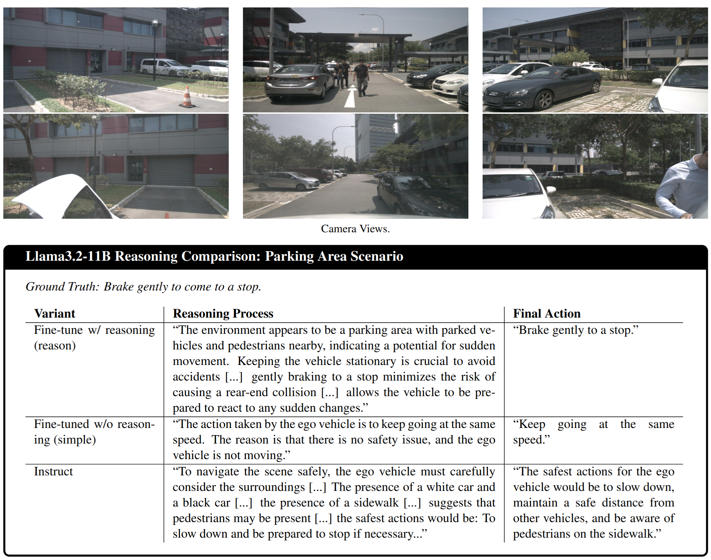
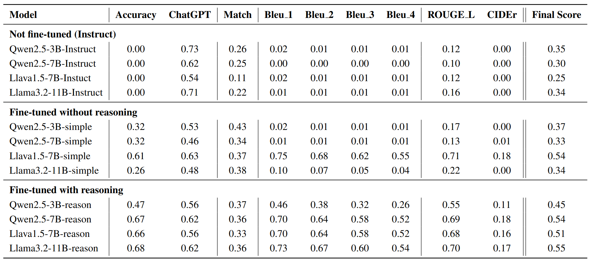

# ReasonDrive

[](https://opensource.org/licenses/MIT)
[](https://www.python.org/downloads/)
[](https://arxiv.org/abs/2501.XXXXX)
[](https://huggingface.co/ac4462)
[](https://huggingface.co/datasets/ac4462/DriveLM-reasoning)

# ReasonDrive: Reasoning-Enhanced Small VLMs for Autonomous Driving

Official implementation of "ReasonDrive: Efficient Visual Question Answering for Autonomous Vehicles with Reasoning-Enhanced Small Vision-Language Models"



## Overview

ReasonDrive investigates whether explicitly modeling reasoning during fine-tuning enhances smaller, deployable Vision-Language Models (VLMs) on driving decision tasks. We introduce:

1. A reasoning-enhanced dataset derived from DriveLM using GPT-4o to generate structured reasoning chains for driving scenarios
2. Comprehensive evaluation of reasoning-based fine-tuning across multiple small VLM families
3. Evidence that explicit reasoning enhances internal representations for driving decisions

Our work shows that reasoning-enhanced fine-tuning creates efficient, interpretable models that address both computational and safety requirements for autonomous vehicles.

## Models

Our trained models are available on Hugging Face:

| Model | Description | Link |
|-------|-------------|------|
| Llama-3.2-11B-Vision-DriveLM-smpl | Llama 3.2 11B with standard fine-tuning | [ac4462/llama-3.2-11b-vision-DriveLM](https://huggingface.co/ac4462/llama-3.2-11b-vision-DriveLM) |
| Llama-3.2-11B-Vision-DriveLM-reason | Llama 3.2 11B with reasoning-enhanced fine-tuning | [ac4462/Llama-3.2-11B-Vision-DriveLM-Cot](https://huggingface.co/ac4462/Llama-3.2-11B-Vision-DriveLM-Cot) |
| Llava-1.5-7B-DriveLM-smpl | Llava 1.5 7B with standard fine-tuning | [ac4462/llava-1.5-7b-DriveLM](https://huggingface.co/ac4462/llava-1.5-7b-DriveLM) |
| Llava-1.5-7B-DriveLM-reason | Llava 1.5 7B with reasoning-enhanced fine-tuning | [ac4462/llava-1.5-7b-DriveLM-Cot](https://huggingface.co/ac4462/llava-1.5-7b-DriveLM-Cot) |
| Qwen2.5-VL-7B-DriveLM-smpl | Qwen 2.5 VL 7B with standard fine-tuning | [ac4462/Qwen2.5-VL-7B-DriveLM](https://huggingface.co/ac4462/Qwen2.5-VL-7B-DriveLM) |
| Qwen2.5-VL-7B-DriveLM-reason | Qwen 2.5 VL 7B with reasoning-enhanced fine-tuning | [ac4462/Qwen2.5-VL-7B-DriveLM-Cot](https://huggingface.co/ac4462/Qwen2.5-VL-7B-DriveLM-Cot) |
| Qwen2.5-VL-3B-DriveLM-smpl | Qwen 2.5 VL 3B with standard fine-tuning | [ac4462/Qwen2.5-VL-3B-DriveLM](https://huggingface.co/ac4462/Qwen2.5-VL-3B-DriveLM) |
| Qwen2.5-VL-3B-DriveLM-reason | Qwen 2.5 VL 3B with reasoning-enhanced fine-tuning | [ac4462/Qwen2.5-VL-3B-DriveLM-Cot](https://huggingface.co/ac4462/Qwen2.5-VL-3B-DriveLM-Cot) |

**Note:** While the model filenames on Hugging Face use "Cot" (Chain of Thought), we refer to these as "reason" models in our paper and documentation.

## Dataset

Our reasoning-enhanced dataset is available on Hugging Face:

- [ac4462/DriveLM-reasoning](https://huggingface.co/datasets/ac4462/DriveLM-reasoning)

This dataset enhances the original DriveLM benchmark with structured reasoning chains for driving scenarios, generated using GPT-4o.

Please refer to [DriveLM dataset](https://github.com/OpenDriveLab/DriveLM/tree/main/challenge#how-to-prepare-data) to prepare the dataset.

## Installation

```bash
# Clone the repository
git clone https://github.com/yourusername/ReasonDrive.git
cd ReasonDrive
```

## Docker Setup

We provide a Docker setup for reproducible environment:

```bash
# Pull the official Qwen Docker image
docker pull qwenllm/qwenvl:2.5-cu121

# Run Docker container with GPU support
./scripts/docker_run.sh
```

## Using Pre-trained Models

```python
from transformers import AutoProcessor, AutoModelForCausalLM
import torch
from PIL import Image

# Load model and processor (example for Llama 3.2)
model_name = "ac4462/Llama-3.2-11B-Vision-DriveLM-Cot"  # Use the "reason" model
processor = AutoProcessor.from_pretrained(model_name)
model = AutoModelForCausalLM.from_pretrained(
    model_name, 
    torch_dtype=torch.float16, 
    device_map="auto"
)

# Load camera views
camera_views = []
for cam in ["front_left", "front", "front_right", "back_left", "back", "back_right"]:
    img_path = f"path/to/CAM_{cam.upper()}.jpg"
    img = Image.open(img_path).convert("RGB")
    camera_views.append(img)

# Prepare prompt
question = "In this scenario, what are safe actions to take for the ego vehicle?"
prompt = f"Question: {question}\n"

# Process inputs and generate response
inputs = processor(text=prompt, images=camera_views, return_tensors="pt").to(model.device)
outputs = model.generate(**inputs, max_new_tokens=512)
response = processor.decode(outputs[0], skip_special_tokens=True)

print(response)
```

## Unsloth Fine-Tuning

We use Unsloth for efficient fine-tuning of our models. Example command:

```bash
CUDA_VISIBLE_DEVICES=0 python scripts/vlm-finetuning.py \
    --model_id "unsloth/Qwen2.5-VL-3B-Instruct-unsloth-bnb-4bit" \
    --output_dir "outputs_Qwen2.5-VL-3B-Instruct" \
    --epoch 5 \
    --batch_size 16 \
    --use_wandb \
    --wandb_project "ReasonDrive" \
    --wandb_run_name "qwen2.5-3B-reason"
```


## Results

Our experiments demonstrate that reasoning-based fine-tuning consistently outperforms alternatives across multiple model families. The Llama3.2-11B-reason model achieves the highest overall performance while maintaining interpretability.



### Performance Comparison

| Model | Accuracy | ChatGPT | Match | Bleu_4 | ROUGE_L | Final Score |
|-------|----------|---------|-------|--------|---------|-------------|
| Llama3.2-11B-reason | 0.68 | 0.62 | 0.36 | 0.54 | 0.70 | 0.55 |
| Qwen2.5-7B-reason | 0.67 | 0.62 | 0.36 | 0.52 | 0.69 | 0.54 |
| Llava1.5-7B-reason | 0.66 | 0.56 | 0.33 | 0.52 | 0.68 | 0.51 |
| Qwen2.5-3B-reason | 0.47 | 0.56 | 0.37 | 0.26 | 0.55 | 0.45 |

## Documentation

- [Using Models and Dataset](docs/model_usage.md)
- [Training Models](docs/training.md)
- [Unsloth Training](docs/unsloth_training.md)
- [Evaluation](docs/evaluation.md)

## Citation

```bibtex
@article{chahe2025reasondrive,
  title={ReasonDrive: Efficient Visual Question Answering for Autonomous Vehicles with Reasoning-Enhanced Small Vision-Language Models},
  author={Chahe, Amirhosein and Zhou, Lifeng},
  journal={arXiv preprint arXiv:2501.XXXXX},
  year={2025}
}
```

## License

This project is licensed under the MIT License - see the [LICENSE](LICENSE) file for details.

## Acknowledgments

- This research was supported in part by NSF MRI Award Number 2320600.
- We thank the authors of DriveLM for releasing their dataset.
